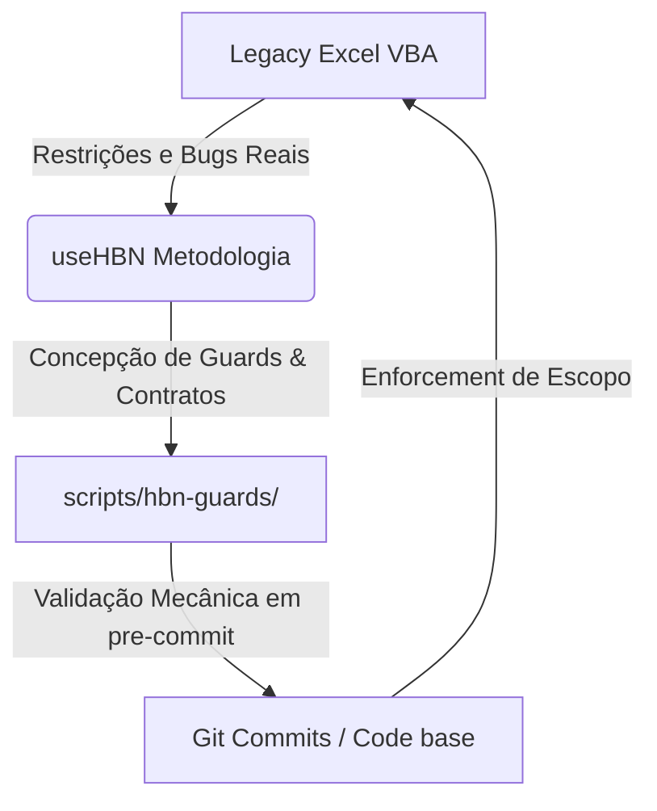
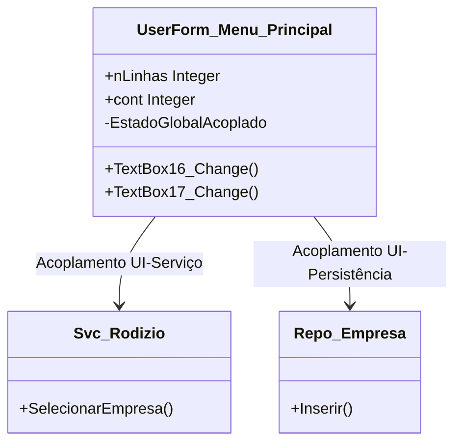

# Auditoria Antigravity/Gemini — V12.0.0206 visão sistêmica

> [!IMPORTANT]
> Este relatório foi elaborado pela IA **Antigravity** atuando como auditora de visão sistêmica e contexto amplo da linha **V12.0.0206** do Sistema de Credenciamento, na branch `codex/v12-0-0206-planejamento`. Nenhuma alteração funcional de código foi aplicada; as análises fundamentam as propostas de refatoração de arquitetura da **V12.0.0207**.

---

## 1. Visão sistêmica do projeto

### 1.1 Credenciamento como Founding Application do HBN
O Sistema de Credenciamento e Rodízio de Pequenos Reparos não é apenas um software de gestão pública municipal; ele é o **berço empírico do protocolo HBN (Human Brain Net)**. Toda a metodologia de coexistência segura e transições inter-IA foi desenvolvida, testada e refinada *a partir* das restrições e desafios de engenharia impostos por este repositório.

A natureza desafiadora de um ambiente Excel/VBA — caracterizado por tipagem fraca, acoplamento profundo entre UI e persistência, e ausência de CI/CD nativo clássico — forçou a criação de mecanismos defensivos que se tornaram os pilares do useHBN:
*   **Fagocitose Progressiva**: A incorporação de tooling moderno (como validadores, hooks Git, analisadores estáticos) sobre um substrato legado altamente volátil.
*   **Coordenação Inter-IA via Bastão**: O uso do `.hbn/relay/INDEX.md` como "registro de bastão" para coordenar sessões sequenciais de diferentes IAs (Codex, Opus, Antigravity) sem colisões de escopo.
*   **Contratos Executáveis e Guards**: A conversão de doutrinas documentais em verificações rígidas executáveis no `pre-commit` (guards), garantindo que desvios de escopo e vazamentos de contexto sejam barrados mecanicamente.

### 1.2 Relação de `usehbn/` com o repositório
O diretório `usehbn/` funciona como um "sub-repositório conceitual" dentro do Credenciamento. Ele contém as especificações formais do protocolo HBN (Fagocitose, Coordenação, Marcadores, etc.) e serve como biblioteca metodológica. 

A relação é de **retroalimentação simbiótica**:
1.  **O Credenciamento fornece a dor e a restrição real**: Cada bug complexo (ex.: erro 424 de WithEvents, contadores AR1 corrompidos por restores de base) expõe uma vulnerabilidade na operação das IAs.
2.  **O useHBN fornece a barreira e a cura**: Em resposta às falhas, novas regras permanentes são injetadas em `.hbn/knowledge/` e novos scripts automatizados são instalados em `scripts/hbn-guards/`.
3.  **Execução em paridade**: O código do produto (VBA) roda sob a tutela direta da camada executável de governança (Guards HBN).



### 1.3 Camadas conceituais do sistema
A arquitetura do Sistema de Credenciamento, embora contida em um arquivo monolítico `.xlsm`, é segmentada mental e estruturalmente em 5 camadas conceituais:

```text
┌─────────────────────────────────────────────────────────────────────────┐
│ 1. CAMADA DE INTERFACE (Menu_Principal.frm, Rel_*, Controles da Planilha)│
└────────────────────────────────────┬────────────────────────────────────┘
                                     ▼
┌─────────────────────────────────────────────────────────────────────────┐
│ 2. CAMADA DE REGRAS DE NEGÓCIO (Svc_OS, Svc_Rodizio, Svc_Entidade, etc.)│
└────────────────────────────────────┬────────────────────────────────────┘
                                     ▼
┌─────────────────────────────────────────────────────────────────────────┐
│ 3. CAMADA DE DADOS E PERSISTÊNCIA (Repo_Empresa, Repo_OS, Abas Excel)   │
└────────────────────────────────────┬────────────────────────────────────┘
                                     ▼
┌─────────────────────────────────────────────────────────────────────────┐
│ 4. CAMADA DE AUDITORIA E TESTE (Audit_Log, Teste_V2_Engine, Gate RVS)   │
└─────────────────────────────────────────────────────────────────────────┘
┌─────────────────────────────────────────────────────────────────────────┐
│ 5. CAMADA DE INSTALAÇÃO E DEPLOY (Importador_V3, vba_import package)    │
└─────────────────────────────────────────────────────────────────────────┘
```

1.  **Interface (UI)**: Formulários `.frm`/`.frx` (`Menu_Principal`, `Rel_OSEmpresa`, `Rel_Emp_Serv`) que expõem os botões e capturam inputs.
2.  **Regras de Negócio (Services)**: Módulos `Svc_*` puramente lógicos e teóricos. Processam o estado da fila, suspendem por strikes, gerenciam a transação administrativa.
3.  **Persistência/Dados (Repos)**: Módulos `Repo_*` que traduzem comandos lógicos em leituras/escritas físicas nas abas do Excel (usando `ListObjects`, ranges e colunas mapeadas).
4.  **Auditoria e Qualidade (Testes/Logs)**: `Audit_Log.bas` gravando mutações na aba `AUDIT_LOG` e a suíte `Teste_V2_Engine.bas` servindo como infraestrutura de assertividade.
5.  **Instalador e Paridade Git (Tooling)**: `Importador_V3.bas` que atua como o "linker" compilando os arquivos textuais `.bas`/`.frm` do Git diretamente para dentro do workbook `.xlsm` através do manifesto.

---

## 2. Inconsistências entre módulos

### 2.1 Lacunas de paridade: `src/vba/` vs `local-ai/vba_import/`
Embora a Onda 37.3 tenha realizado um reset total que garantiu paridade de bytes entre a pasta do Git (`src/vba/`) e a planilha de homologação física exportada (V5), o processo de sincronização é **vulnerável ao fator humano**:
*   A sincronização depende da execução manual do script `publicar_vba_import_v2.sh --apply` pela IA ou pelo operador.
*   Não há um "linter de paridade" bloqueando commits se houver mutações em `src/vba/` sem a correspondente geração de pacotes prefixados em `local-ai/vba_import/001-modulo/`. O guard `assert-scope-lock.sh` limita arquivos staged por escopo, mas não garante a *sincronização bidirecional interna* de forma automática.
*   **Friction de prefixação**: A pasta `vba_import/` usa mapeamento por prefixos (ex.: `AAE-Util_Planilha.bas`) para contornar limitações de importação em lote do VBA. Mudanças na ordem de importação ou novos módulos exigem alteração manual em `000-MANIFESTO-*` e `000-MAPA-PREFIXOS.txt`, um foco recorrente de erro de compilação.

### 2.2 Conflitos entre documentação canônica (`AGENTS.md`, `CLAUDE.md`) e código real
*   **O tabu do `Mod_Types.bas` vs Glasswing G8**: O documento `CLAUDE.md` e a doutrina proíbem tocar em `Mod_Types.bas` fora da Onda 9. Porém, a criação do módulo `Util_Excel_Performance.bas` na Onda 38.2.1-AR1-FIX2-PERF exigia o retorno de um tipo composto para salvar o estado do Excel (`Application.Calculation`, `ScreenUpdating`, etc.). Como `Mod_Types.bas` era inacessível, a IA teve de recorrer a um "workaround" de acoplamento fraco: retornar um `Variant array(0..3)` e descompilar as posições manualmente. Isso satisfaz o guard, mas gera débito técnico de legibilidade.
*   **O tabu do `Importador_V3.bas`**: Considerado "blindado", o importador apresenta gargalos operacionais (como o abortamento `BUMP_NO_CHANGE` documentado na HBN 0016). A proibição de reestruturar o importador impede a correção definitiva desse parser de texto.

### 2.3 Drift de Vitrine e Documentação (`obsidian-vault/`, `docs/`)
*   **Atraso na Matriz de Cobertura**: Os documentos `docs/reference/regras/REGRAS_DE_NEGOCIO_V205.md` e `obsidian-vault/releases/V12.0.0205.md` indicam estabilização congelada e declaram que não há alterações de regras de negócio. No entanto, as ondas recentes da V206 introduziram **regras de comportamento operacional de infraestrutura críticas**:
    1.  *Guarda Monotônica de ID*: IDs apagados historicamente geram buracos permanentes na sequência e impedem a regressão de contadores.
    2.  *Validação Dinâmica de Coluna A*: `ProximoId` agora lê a coluna A dinamicamente para evitar conflitos manuais.
    Esses comportamentos alteram o comportamento esperado do sistema e deveriam ser catalogados como regras funcionais secundárias no Diataxis.

---

## 3. Impacto na documentação

### 3.1 Conteúdo obsoleto ou defasado
*   **Terminologia de Testes Dupla**: O changelog e os documentos canônicos declaram a substituição dos nomes legados ("Sexteto", "Quinteto", "Quarteto") pelas marcas profissionais (RVS, SRC, BRL). No entanto, o código real dos módulos de teste (`Teste_Validacao_Release.bas`) e as mensagens de log HBN continuam referenciando extensivamente os termos legados. A coexistência dos dois termos gera confusão cognitiva para novas IAs que entram no projeto.
*   **Procedimento de Saneamento Manual**: O manual do operador não documenta o papel do `Util_Sanear_Contadores.bas` nem explica sob quais circunstâncias o administrador do município deve rodar `SanearContadoresAR1` na janela imediata.

### 3.2 O que falta documentar?
*   **A arquitetura de controle de concorrência e transações**: O funcionamento interno de `Svc_Transacao.bas` (início, commit, rollback) e sua interação com interrupções abruptas de macro não está claro na pasta `docs/explanation/`.
*   **O padrão de envelopamento de performance**: A lógica de `Variant array` usada pelo `Util_Excel_Performance` precisa de documentação clara de "how-to" para que desenvolvedores não tentem refatorá-la incorretamente para tipos definidos pelo usuário (UDT).

### 3.3 Sincronização de Diataxis com ondas curtas
Para evitar o "code-doc rot" em ondas rápidas (safe_track de 1-2 turnos), o protocolo HBN deve institucionalizar o **"Doc-Delta Pattern"**:

> [!TIP]
> **Proposta de Regra Doc-Delta**: Todo readback JSON que declare mutação em arquivos de produção (`.bas`/`.frm`) deve obrigatoriamente incluir no array `scope.files_allowed` pelo menos um arquivo de documentação Diataxis correspondente sob o diretório `docs/` ou `obsidian-vault/`. O commit de fechamento da onda será rejeitado se não contiver o ajuste documental do comportamento alterado.

---

## 4. Lacunas de auditoria

### 4.1 Rastreabilidade frágil
*   **O "Ponto Cego" dos arquivos `.frx`**: Os formulários VBA são formados pela dupla `.frm` (texto com código e definição de controles) e `.frx` (binário com dados de imagem, ícones e propriedades estendidas). O Git rastreia apenas o `.frm` de forma semântica. Se um designer ou IA alterar visualmente um form e corromper o `.frx`, o commit passará pelos guards de texto HBN sem apontar o erro. O primeiro sinal de falha será um travamento do Excel ao carregar o UserForm.
*   **Ausência de Logs de Erro de Compilação**: Quando o operador roda a importação via `ImportarPacoteV3` e o Excel sofre um crash ou falha de compilação silenciosa, o rastro do erro se perde. O Git permanece limpo e o repositório não registra a evidência da falha.

### 4.2 Decisões em chat não consolidadas
Muitas discussões críticas de arquitetura entre o operador (Mauricio) e a IA Opus ocorreram puramente na janela de chat e foram sintetizadas de forma incompleta no handoff:
1.  O racional para a **exclusão definitiva** de `Emergencia_CNAE.bas` na V206.
2.  A aceitação do risco de **gaps sequenciais permanentes** nos IDs em favor da monotonicidade.



---

## 5. Riscos de longo prazo

### 5.1 Débitos técnicos críticos e Code Rot
*   **Bottleneck de Reload de ListBox (F-NEW4)**: O carregamento de listas de empresas e entidades no `Menu_Principal.frm` lê diretamente da planilha célula por célula. À medida que o município cadastra centenas de reparadores, o tempo de inicialização da tela e o tempo pós-cadastro crescerão de forma exponencial. O speedup LITE de performance (~2x obtido na V206) será rapidamente engolido pelo crescimento da base.
*   **Acoplamento em `Preencher.bas`**: Este módulo centraliza o preenchimento de todos os controles de UI. Ele manipula variáveis de escopo global (`nLinhas`, `cont`, `i`) e está fortemente acoplado às abas físicas. Qualquer alteração de layout nas abas pode quebrar silenciosamente os loops de preenchimento.
*   **Ausência de Testes E2E de UI Reais**: A suíte `TV2_RunAdversarial_UI` valida apenas o estado lógico dos serviços simulando cliques, mas não testa se os controles físicos do UserForm (TextBox, ListBox, ComboBox) estão devidamente associados às variáveis corretas.

---

## 6. Impacto na experiência do usuário

A análise sistêmica aponta que o gestor público do município (usuário final) é afetado diretamente por três fatores da arquitetura V206:

| Sintoma Percebido | Causa Arquitetural | Severidade | Impacto no Usuário |
|---|---|---|---|
| **Lentidão ao salvar cadastros** | Redesenho de grid (ScreenUpdating) e cálculo de fórmulas acoplados a cada escrita. | **Alto** | Frustração operacional; sensação de travamento em PCs antigos. |
| **Identificadores inconsistentes (F-NEW3)** | Falta de formatação explícita da coluna A no ListObject (`5` vs `005`). | **Baixo (Cosmético)** | Confusão visual ao ler relatórios em PDF ou telas de consulta. |
| **Perda de dados em falhas** | Ausência de transações reais de banco de dados; dependência de backups físicos. | **Crítico** | Risco de perda de cadastros do dia se o Excel corromper ou crashar. |

---

## 7. Preparação para SaaS

### 7.1 Facilitadores na V206
1.  **Regras em Módulos Stateless (`Svc_*`)**: A separação das regras (rodízio, strikes) em módulos sem estado facilita a transposição desse código para uma linguagem backend (como TypeScript/Python).
2.  **ID Monotônico Estável**: A garantia de que os IDs nunca regridem e são únicos dentro da aba é crucial para cenários de migração, permitindo consolidar bases de múltiplos municípios em um banco de dados centralizado sem colisão de chaves estrangeiras.

### 7.2 Dificultadores na V206
1.  **Acoplamento profundo com o modelo de dados do Excel**: Rotinas de regras de negócio ainda dependem de estruturas de planilha como `ListObjects`, `Range` e coordenadas físicas de colunas.
2.  **UI baseada em UserForms legados**: A migração para SaaS exigirá uma reescrita completa da interface em tecnologia web (HTML/JS/CSS).

### 7.3 Preservação da planilha como entrada/saída (Não Aprisionamento)
Para garantir a independência tecnológica do município e cumprir a diretriz estratégica não negociável, a planilha deve ser tratada no modelo SaaS como:

*   **Offline-First Client**: O município pode baixar a planilha e realizar cadastros locais.
*   **Universal Migration Format**: Se o município decidir sair do SaaS, ele pode solicitar um export completo de sua base diretamente no formato de abas estruturadas do Excel. Uma planilha com os módulos VBA monolíticos originais é compilada sob demanda no servidor e entregue ao usuário, permitindo que ele continue a operação localmente de forma idêntica e sem perda de histórico.

```text
               ┌────────────────────────┐
               │    SaaS Backend        │
               └───────────┬────────────┘
                           │
             Exportação    │   Importação
             JSON/Excel    │   via API
                           ▼
               ┌────────────────────────┐
               │  Excel Offline-First   │ (Garantia de Soberania
               │     (.xlsm local)      │  Tecnológica)
               └────────────────────────┘
```
