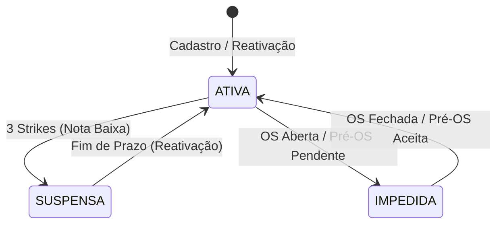

# Auditoria de Integridade Referencial e Idempotência — Antigravity (Onda 38.2.3 pre-flight)

> [!IMPORTANT]
> Este relatório foi elaborado pela IA **Antigravity** atuando como auditora de visão sistêmica e contexto amplo da linha **V12.0.0206** do Sistema de Credenciamento, na branch `codex/v12-0-0206-planejamento` (HEAD `731bc9e`). Nenhuma alteração funcional de código foi aplicada; o escopo limita-se ao diagnóstico dos 3 vetores observados e à modelagem do plano de correção em camadas para a Onda 38.2.3.

---

## 1. Leitura sistêmica dos 3 vetores

A ocorrência simultânea da falha do RVS `VR_20260527_060519` e do erro operacional `F-NEW5` aponta para um desgaste sistêmico decorrente de correções cumulativas em microdeltas sem a devida reconciliação de fronteiras. Analisamos o que cada vetor revela sobre a saúde arquitetural:

### 1.1 Vetor 1 — F-NEW5: Rodízio "sem empresas" em atividade nova
*   **O Sintoma**: Empresa 5 credenciada na nova atividade `005` (Algodão Herbáceo) falha na emissão de Pré-OS porque o sistema alega que não há empresas credenciadas aptas. O relatório de credenciamentos mostra `STATUS_CRED` **vazio** para novos credenciamentos.
*   **Leitura Arquitetural**: A escrita de `STATUS_CRED` ocorre corretamente em `Credencia_Empresa.frm:178` com o literal `"ATIVO"`. No entanto, como a coluna `ATIV_ID` foi escrita na planilha sem formatação textual (`NumberFormat="@"`), o Excel reinterpretou a string `"005"` como o número `5`. 
*   **O Efeito Cascata**: O loop de busca em `Svc_Rodizio` e `Repo_Credenciamento` itera as linhas. Se a comparação de `ATIV_ID` ou do código de serviço concatenado (`codAtivServ`) for realizada em locais que bypassam o `IdsIguais` central (como seleções diretas de ComboBox, filtros de ListBox ou montagem de chaves), ocorre um **mismatch de tipo** (String `"005"` vs Double `5`). O rodízio falha silenciosamente ao associar a empresa à atividade, resultando em "zero credenciados". O status de credenciamento vazio no relatório é um sintoma secundário de colunas deslocadas ou erro silencioso de parsing durante o reload da ListBox.

### 1.2 Vetor 2 — V2_SMOKE drift estrutural: `Cadastro_Servico.frm`
*   **O Sintoma**: Divergência de 128 caracteres normalizados entre o arquivo `.frm` e o `.code-only.txt`.
*   **Leitura Arquitetural**: Revela uma **quebra na disciplina do fluxo de trabalho inter-IA e do pre-commit**. Hotfixes consecutivos foram aplicados diretamente pelo editor VBE (workbook local do operador) sem a devida execução do script de reconciliação de espelhos (`publicar_vba_import_v2.sh --apply`) ou sem commitar os deltas gerados. O Git perdeu a sincronia como única fonte de verdade.

### 1.3 Vetor 3 — V2_E2E_STRIKES `DIAG_PREOS_INTEGRITY` (mismatch de tipo)
*   **O Sintoma**: EMP_PRESEL=`"001"` (String) vs EMP_PREOS=`1` (Double).
*   **Leitura Arquitetural**: **Excel é um banco de dados schemaless e mutável**. Se o programador escreve um ID textual (`"001"`) sem forçar o formato de texto (`NumberFormat="@"`), o Excel assume que o dado é numérico e remove os zeros à esquerda (`1`). Quando hydrated via `CStr(ws.Cells.Value)`, a String retornada é `"1"`, quebrando a integridade de chaves estrangeiras. A Onda 38.2.2 corrigiu a escrita na UI de cadastros, mas deixou de fora Repos cruciais como `Repo_PreOS`, `Repo_OS`, `Repo_Avaliacao` e as fixtures de teste.

> [!NOTE]
> **Veredito F-NEW6**: A hipótese sistêmica **F-NEW6 procede integralmente**. A inconsistência de `NumberFormat` em escritas acoplada ao uso de `CStr` puro (sem `Pad3` ou normalização na leitura) é a causa raiz da desestabilização da integridade referencial.

---

## 2. Anti-padrões identificados além do F-NEW6

1.  **Dispersão do `NumberFormat = "@"`**: A aplicação do formato textual está espalhada ad-hoc em eventos de formulário (UI) e em algumas poucas rotinas de repositórios. A falta de uma rotina de escrita centralizada torna o sistema vulnerável a esquecimentos de desenvolvedores.
2.  **Passividade do `CStr` na Hidratação**: O uso de `CStr(ws.Cells(..., COL_ID).Value)` nos Repos assume de forma ingênua que a célula manteve seu tipo textual. É um anti-padrão de "confiança cega" na persistência do Excel.
3.  **Duplicação de `IdsIguais` e Comparações Diretas**: A presença de funções privadas `IdsIguais` em `Menu_Principal.frm`, `Preencher.bas` e `Credencia_Empresa.frm` (como `IdsIguaisCred` ou `CodAtivServIgual` locais) cria desvios de comportamento. Pior: há pontos que ainda usam comparação direta `If ID1 = ID2 Then`, suscetíveis a falhas silenciosas de tipo.
4.  **Gravação em Múltiplos Paths**: Repositórios, UserForms e Fixtures de Testes escrevem diretamente nas planilhas de forma independente, sem uma API ou barramento único de persistência.

---

## 3. Invariantes da Máquina de Estados violadas

A Máquina de Estados do Credenciamento (Sprint 0) assume premissas matemáticas que hoje estão violáveis:



1.  **Invariante da Identidade Estável (Chave Primária)**: O ID de uma entidade é imutável em todo o seu ciclo de vida. *Violação*: O ID `"001"` vira `1` em `PRE_OS`, quebrando o vínculo de integridade com a tabela `EMPRESAS`.
2.  **Invariante da Fila Íntegra**: O rodízio assume que toda empresa na fila de credenciamento possui um `STATUS_CRED` válido (`"ATIVO"`). *Violação*: `STATUS_CRED` gravado em linhas de dados incoerentes devido a offsets de colunas ou falhas no parser local.
3.  **Invariante de Strike Justo**: A contagem de strikes para suspensão (`Repo_Avaliacao.ContarStrikesParaPunicao`) assume que o `EMP_ID` em `CAD_OS` e `AVALIACOES` corresponde de forma exata ao `EMP_ID` em `EMPRESAS`. Se um é lido como `"001"` e o outro como `"1"`, as avaliações são orfanadas, e a empresa deixa de receber strikes, burlando o sistema de punições.

---

## 4. Mapa de idempotência das operações principais

| Operação | É idempotente hoje? | Onde quebra? | Severidade |
|---|---|---|---|
| `Repo_Empresa.Inserir` | **Não** | Se chamada repetidamente, insere registros duplicados com novos IDs sequenciais. | **Alta** |
| `Repo_Empresa.Atualizar` | **Sim** | Sobrescreve as propriedades na mesma linha identificada pelo ID. | **Nula** |
| `Repo_Empresa.GravarStatusEmpresa` | **Sim** | Modifica o status na linha física, sem efeitos cumulativos. | **Nula** |
| `Credencia_Empresa.CR_Credenciar_Click` | **Não totalmente** | Embora `CredJaExiste` evite duplicações no mesmo serviço, falhas intermediárias do loop de serviços podem gravar estados parciais e inconsistentes em `CREDENCIADOS`. | **Média** |
| `Cadastro_Servico.S_Cadastrar_SV_Click` | **Não** | Grava novas linhas repetidas com IDs sequenciais na aba `CAD_SERV`. | **Alta** |
| `Svc_PreOS.EmitirPreOS` | **Não** | Cria registros duplicados em `PRE_OS` e avança a fila do rodízio incorretamente a cada chamada repetida. | **Crítica** |
| `Svc_OS.EmitirOS` | **Não** | Grava duplicatas em `CAD_OS` e gera OSs fantasmas para a mesma Pré-OS. | **Crítica** |
| `Svc_Avaliacao.RegistrarAvaliacao` | **Não** | Registra avaliações duplicadas em `AVALIACOES` e incrementa strikes globais repetidamente, gerando suspensões indevidas. | **Crítica** |
| `Svc_Rodizio.AvancarFila` | **Não** | Move a empresa para o fim da fila consecutivas vezes e duplica o incremento de contadores de recusa global. | **Crítica** |
| `Svc_Rodizio.SelecionarEmpresa` | **Sim** | Realiza leitura e atualiza apenas a data de indicação temporária `DT_ULT_IND` na mesma posição da fila. | **Nula** |
| `Util_Sanear_Contadores.SanearContadoresAR1` | **Sim** | Calcula e grava o `max(ID)` de forma monotônica, seguro para execução repetida. | **Nula** |
| `IniciarSistema` (no `Workbook_Open`) | **Sim** | Inicializa variáveis globais e protege as abas sem corrupção de estado. | **Nula** |

---

## 5. Integridade referencial: Invariantes desejadas e auditoria

Propomos um conjunto de invariantes relacionais estritas que devem ser mantidas em qualquer freeze de versão:

1.  `CREDENCIADOS.EMP_ID` $\rightarrow$ Existe em `EMPRESAS.EMP_ID` ou `EMPRESAS_INATIVAS.EMP_ID`.
2.  `CREDENCIADOS.ATIV_ID` $\rightarrow$ Existe em `ATIVIDADES.ATIV_ID`.
3.  `CREDENCIADOS.COD_ATIV_SERV` = `ATIV_ID & SERV_ID` $\rightarrow$ Ambos com formatação `Pad3` e validados em `CAD_SERV.COL_SERV_ID` associados à atividade.
4.  `PRE_OS.EMP_ID` em `EMPRESAS` + `PRE_OS.ATIV_ID` em `ATIVIDADES` $\rightarrow$ Deve possuir um credenciamento ativo (`STATUS_CRED = "ATIVO"`) em `CREDENCIADOS`.
5.  `CAD_OS.PREOS_REF` $\rightarrow$ Existe em `PRE_OS.COL_PREOS_ID`.
6.  `AVALIACOES.OS_REF` $\rightarrow$ Existe em `CAD_OS.COL_OS_ID`.

### Instrumentação: `Util_Auditoria_Integridade.bas`
Recomendamos a criação de um módulo de auditoria contínua a ser invocado pela Central de Testes (ou associado ao `Workbook_BeforeSave` em modo silencioso) contendo a rotina `Sub AuditarIntegridadeReferencial()`. Esta rotina executa varreduras cruzadas usando obrigatoriamente a função central `IdsIguais` e cospe um relatório CSV em `auditoria/evidencias/` contendo todas as referências órfãs detectadas.

---

## 6. Plano de correção em camadas

```text
┌────────────────────────────────────────────────────────┐
│     Camada 4: MIGRAR DADOS LEGADOS (Workbook Ativo)    │
└───────────────────────────┬────────────────────────────┘
                            ▼
┌────────────────────────────────────────────────────────┐
│     Camada 3: AUDITORIA CONTÍNUA (Garantia de Freeze)  │
└───────────────────────────┬────────────────────────────┘
                            ▼
┌────────────────────────────────────────────────────────┐
│     Camada 2: HIDRATAÇÃO CONSISTENTE (LerIdTextual)    │
└───────────────────────────┬────────────────────────────┘
                            ▼
┌────────────────────────────────────────────────────────┐
│     Camada 1: HELPERS COMPARTILHADOS (GravarIdTextual) │
└────────────────────────────────────────────────────────┘
```

### Camada 1 — Helpers compartilhados (Centralização)
*   **Ação**: Criar `Util_Planilha.GravarIdTextual(ByVal ws As Worksheet, ByVal linha As Long, ByVal coluna As Long, ByVal idValue As Variant)`. Esta função aplica `NumberFormat = "@"` e grava `Pad3(idValue)` em um único ponto.
*   **Estimativa**: 1 onda (`Onda 38.2.3`).
*   **Substituições**: Substituir todas as atribuições diretas de `.Value = ID` em `Repo_OS`, `Repo_PreOS`, `Repo_Avaliacao`, `Repo_Credenciamento` e nos formulários UI.

### Camada 2 — Hidratação consistente
*   **Ação**: Criar `Util_Planilha.LerIdTextual(ByVal ws As Worksheet, ByVal linha As Long, ByVal coluna As Long) As String`. Esta função extrai o valor da célula, valida se é nulo/erro e retorna a representação com `Pad3` caso seja numérico.
*   **Estimativa**: 1 onda (`Onda 38.2.4`).
*   **Substituições**: Substituir todas as chamadas `CStr(ws.Cells(..., COL_ID).Value)` por `LerIdTextual` nos 5 Repos principais.

### Camada 3 — Auditoria contínua
*   **Ação**: Implementar `Util_Auditoria_Integridade.bas` e acoplá-lo como um novo assert da suíte `TV2_RunIntegridadeBase` no RVS.
*   **Estimativa**: 1 onda (`Onda 38.2.5`).

### Camada 4 — Migração de dados legados
*   **Ação**: Criar uma macro executável descartável `Util_Migrar_IDS_Workbook()`. Ela desprotege as abas, varre todas as colunas de ID operacionais em dados já existentes no workbook ativo, aplica a formatação `@` e reescreve os IDs numéricos (como `1`) como texto formatado (`"001"`).
*   **Estimativa**: Executada em conjunto com a `Onda 38.2.3`.

---

## 7. Sequência de ondas até freeze V206

1.  **Onda 38.2.2-reapply (Trivial)**:
    *   Executar `publicar_vba_import_v2.sh --apply` para sanear o drift de 128 caracteres em `Cadastro_Servico.frm`, restaurando a paridade de cabeçalho do RVS.
2.  **Onda 38.2.3 (F-NEW5 + Camada 1 + Camada 4)**:
    *   Implementar `GravarIdTextual` e a macro de migração estrutural.
    *   Rodar a macro de migração 1x no workbook do operador.
    *   *Pausa de Validação*: Teste manual do cadastro de nova atividade/empresa e verificação física do status `"ATIVO"` na coluna M de `CREDENCIADOS`.
3.  **Onda 38.2.4 (F-NEW6 + Camada 2)**:
    *   Substituir `CStr` por `LerIdTextual` em todos os Repos.
    *   *Pausa de Validação*: Rodar `TV2_RunSmoke` para certificar integridade estrutural.
4.  **Onda 38.2.5 (Auditoria + Fixtures + RVS Verde)**:
    *   Implementar `Util_Auditoria_Integridade` e acoplá-lo no RVS.
    *   Ajustar eventuais referências numéricas legadas em fixtures de teste.
    *   *Freeze*: Execução e aprovação do RVS Trio.

---

## 8. Riscos sistêmicos e mitigações

*   **Risco 1: Quebra de fixtures históricas nos testes V2**
    *   *Descrição*: Os testes de integração da suíte `Teste_V2_Engine` podem conter mock IDs configurados de forma mista (alguns textuais, outros numéricos) que passarão a falhar com a rigidez do `LerIdTextual` e `GravarIdTextual`.
    *   *Mitigação*: O helper `LerIdTextual` deve tolerar mocks maiores de 3 dígitos (como `999` ou `9999`) sem truncá-los, aplicando o `Pad3` apenas a IDs que contenham de 1 a 3 dígitos puramente numéricos.
*   **Risco 2: Corrupção estrutural de dados legados durante a migração**
    *   *Descrição*: A macro de migração pode travar no meio ou corromper fórmulas se houver interrupção.
    *   *Mitigação*: Exigir do operador backup obrigatório do workbook (.xlsm) antes de rodar a macro. A macro deve rodar envelopada com o wrapper de performance `Util_IniciarBlocoRapido` para garantir velocidade e atonicidade.

---

## 9. Comentário sobre L40 (Meta-validação)

> [!TIP]
> A suíte de testes do Credenciamento é robusta, mas apresenta a vulnerabilidade da **estaticidade de fixtures** (L40). Ela testa com maestria se os dados da fixture (ex.: Empresa `"001"`, Atividade `"999"`) comportam-se bem, mas não valida se os fluxos de cadastros *gerados em tempo real na interface pelo usuário* mantêm as invariantes relacionais.

Para garantir que a suíte cubra fluxos não-fixture antes do freeze V206:
*   A onda 38.2.5 deve introduzir um assert de meta-validação em `E2E_CADASTROS`: o próprio teste cria uma atividade randômica (ex.: ID gerado no momento do teste), cadastra um serviço dinâmico e credencia uma nova empresa gerada em runtime. 
*   O teste então executa o rodízio sobre esta atividade dinâmica e valida a emissão da Pré-OS. 
*   Se o rodízio rodar com sucesso sobre chaves criadas dinamicamente e sem herança de fixture, a arquitetura prova sua **independência de dados** de forma categórica e o freeze torna-se verdadeiramente seguro.
