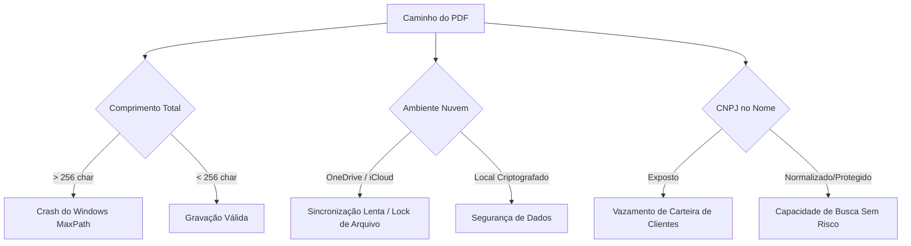
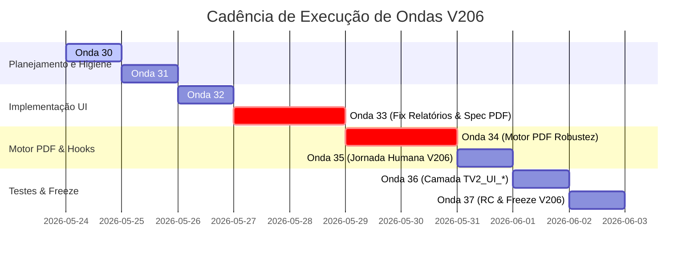

# Auditoria Adversarial PDF/UI V206 — Gemini

## 1. Veredito Adversarial

**APROVAÇÃO CONDICIONAL E ADVERSARIALMENTE BLINDADA.**

A proposta da V12.0.0206 é tecnicamente viável e muito bem estruturada no parecer de Claude Opus (documento [95_AUDITORIA_PDF_UI_V206_CLAUDE_OPUS.md](file:///Users/macbookpro/Projetos/Credenciamento/auditoria/00_status/95_AUDITORIA_PDF_UI_V206_CLAUDE_OPUS.md)), mas apresenta armadilhas silenciosas que podem comprometer a estabilidade do sistema, a segurança de dados sensíveis e a integridade da suíte RVS.

Nossa auditoria adversarial confirma categoricamente o **Bug de Instância Dupla/Fantasma** nos relatórios de Ordens de Serviço por Empresa (`Rel_OSEmpresa`) e de Empresas por Serviço (`Rel_Emp_Serv`). **A correção deste bug na UI deve obrigatoriamente preceder qualquer tentativa de gerar PDFs**, sob o risco crítico de gerar "PDFs tecnicamente perfeitos de relatórios em branco".

Para garantir que a Onda 34 a 37 transcorra sem regressões na baseline V205 (`f24e535`), as blindagens abaixo são declaradas obrigatórias.

> [!IMPORTANT]
> A assinatura RVS da V12.0.0205 deve ser mantida como invariante inegociável de não-regressão:
> `V1=171/0+V2_Smoke=34/0+V2_Canonica=24/0+E2E_Strikes=76/0+IntegridadeBase=4/0+Onda23Adv=27/0`
> Nenhuma funcionalidade de PDF ou teste de UI pode registrar ou alterar esses contadores. O RVS deve ser um "santuário funcional".

---

## 2. Achados de Auditoria (P0 a P3)

### Achados P0 (Bloqueantes Absolutos)
*   **P0-01: Contaminação do RVS por PDF:** Tentativas de integrar os assertions de arquivos PDF gerados nas sub-baterias existentes do RVS são estritamente proibidas. O motor PDF deve possuir testes complementares e isolados.
*   **P0-02: Modificação de Serviços Blindados:** Qualquer alteração em `Svc_Rodizio.bas`, `Svc_Avaliacao.bas`, `Svc_OS.bas` e `Svc_PreOS.bas` está travada. A geração de PDF deve ser puramente reativa ou acoplada às camadas de exibição/UI.
*   **P0-03: Alteração de RN-01 a RN-17:** A lógica de negócio e os limites operacionais (CNAE, strikes, suspensões, rodízio) não podem sofrer qualquer desvio ou afrouxamento na V206.

### Achados P1 (Correções e Ajustes Obrigatórios para V206)
*   **P1-01: Bug de Instância Fantasma / Formulário Vazio (Menu_Principal.frm:3110 e 3221):**
    *   *Mecânica:* `PreenchimentoRelatorioOSEmpresa` e `PreenchimentoRel_EmpXServ` criam ou buscam uma instância fantasma do form (Instância A) via `ControleFormulario` em [Preencher.bas:1385](file:///Users/macbookpro/Projetos/Credenciamento/src/vba/Preencher.bas#L1385) e populam seu ListBox. Logo em seguida, o `Click` do Menu Principal cria uma **segunda instância independente** (Instância B) via `VBA.UserForms.Add` e a exibe vazia na tela.
    *   *Risco:* A tela de relatório é exibida sem dados para o operador. Se o PDF for gerado, o arquivo será gravado com layout impecável, mas sem registros (conteúdo em branco), ocultando a falha de preenchimento.
    *   *Mitigação:* Reestruturar o `Click` no menu para instanciar explicitamente o formulário primeiro, populá-lo usando a mesma instância ativa, e somente então chamar o `.Show`.
*   **P1-02: Colisão de Timestamp no Nome do PDF:**
    *   *Mecânica:* A especificação original permitia timestamps no formato `AAAAMMDD_HHNN` (4 dígitos). Em rotinas de geração automatizada rápida ou simulação de cliques (onde testes rodam em milissegundos), múltiplos PDFs gerados no mesmo minuto colidem e geram falhas catastróficas de I/O ou sobrescrita silenciosa.
    *   *Mitigação:* Exigir o uso estrito do formato de 6 dígitos de tempo `AAAAMMDD_HHNNSS` usando a constante e helper padrão de [Util_Config.bas:362](file:///Users/macbookpro/Projetos/Credenciamento/src/vba/Util_Config.bas#L362).
*   **P1-03: Raiz de Documentos Fora do Repositório Git:**
    *   *Risco:* A geração de PDFs na pasta raiz ou em subpastas internas do repositório pode levar à inclusão acidental de dados operacionais confidenciais (CNPJ, valores de empenho, nomes de servidores) no controle de versão git.
    *   *Mitigação:* A pasta raiz canônica `Documentos_Gerados/` deve residir localmente na pasta `Documents` do usuário logado (usando `Environ$("USERPROFILE")` no Windows e caminhos nativos no macOS), com caminho configurável e guardada defensivamente por regras estritas de `.gitignore` na raiz do repositório.
*   **P1-04: Log de Emissões Append-Only desde o MD-34.0:**
    *   *Risco:* O motor de geração de PDFs operando de forma silenciosa e sem log impede a auditoria forense de emissões e impossibilita a validação de testes automatizados.
    *   *Mitigação:* A criação do log `RPT_PDFs_EMITIDOS.csv` deve ser implementada no mesmo microdelta que o gerador do PDF, com tratamento robusto de concorrência (`Open For Append` e tentativas com recuo exponencial).

### Achados P2 (Melhorias de Robustez Recomendadas)
*   **P2-01: Sanitização de CNPJ com Fallback Seguro:**
    *   *Mecânica:* O CNPJ obtido da planilha ou da interface pode conter espaços, pontos, barras ou traços, além de risco de strings corrompidas ou nulas.
    *   *Mitigação:* Limpeza agressiva via `Replace` para conter apenas dígitos numéricos (14 bytes). Se vazio ou corrompido, usar o fallback explícito `CNPJ_SEM_CNPJ` ou `CNPJ_INVALIDO_<ID_DOCUMENTO>` impedindo a falha no VBE.
*   **P2-02: Limpeza de Instâncias Fantasma na Inicialização do Menu:**
    *   *Mecânica:* O `UserForm_Initialize` de `Menu_Principal` faz uma chamada redundante a `Call PreenchimentoRelatorioOSEmpresa` (linha 3354), gerando uma instância inútil na memória no boot da planilha.
    *   *Mitigação:* Remover essa linha na Onda 33 para evitar desperdício de recursos.

### Achados P3 (Evolução SaaS e Próximas Releases - V12.0.0207)
*   **P3-01: Automação por cliques reais na UI:** Deixar testes por simulação de cliques baseados em drivers de terceiros (Python `pywin32` ou AppleScript no macOS) exclusivamente para a V207. A V206 deve focar exclusivamente em simulação determinística interna (`Teste_V2_UI.bas`).

---

## 3. Riscos de Nomenclatura e Pastas (Jornada Humana e Operacional)

A estrutura aprovada de subpastas resolve muito bem o fluxo visual e a segregação de arquivos. Contudo, sob uma análise adversarial, identificamos três superfícies de falha:



### Análise de Caminhos Longos (Windows MaxPath)
No Windows, o limite do sistema para caminhos de arquivos (incluindo o nome) é de 260 caracteres.
*   *Cálculo Adversarial:*
    Se a pasta do usuário estiver em:
    `C:\Users\NomeDoUsuarioMuitoLongo\OneDrive - NomeDaEmpresaSuperExtensa\Documents\Documentos_Gerados\Relatorios\` (~105 caracteres)
    E o nome do arquivo seguir o padrão canônico:
    `REL_ORDEM_SERVICO_EMPRESA_CNPJ_12345678000199_20260524_153022.pdf` (66 caracteres)
    O comprimento total alcançará ~171 caracteres. Se a raiz do operador for profunda, o Excel falhará silenciosamente no `ExportAsFixedFormat`.
*   *Mitigação:* O motor `Util_PDF` deve computar preventivamente o comprimento do caminho absoluto gerado e, se exceder 240 caracteres, truncar amigavelmente o prefixo do nome e gravar um aviso no `Audit_Log`.

### Exposição de CNPJ e Dados Sensíveis
O uso de CNPJ limpo no nome do arquivo facilita a busca, mas expõe dados se a pasta raiz for sincronizada com nuvens públicas não corporativas.
*   *Mitigação:* A jornada humana deve orientar a desativação da sincronização automática para a pasta `Documentos_Gerados` e incentivar a criptografia de disco local (BitLocker/FileVault).

---

## 4. Riscos do Motor PDF e Robustez VBA

O método nativo `ExportAsFixedFormat` do Excel é a escolha correta pela simplicidade e ausência de dependências externas, mas apresenta riscos graves de falha silenciosa:

1.  **Falha de Gravação por Permissão de Pasta:** Se o operador não tiver permissão de escrita ou a pasta não existir.
    *   *Mitigação:* O motor `Util_PDF_ResolverPasta` deve validar o diretório de destino e executar recursivamente `MkDir` com tratamento de erro integrado (`On Error Resume Next`).
2.  **Geração de Arquivo Vazio ou Corrompido:** Em situações de pouca memória no Excel, o PDF pode ser gravado com 0 bytes ou corrompido.
    *   *Mitigação (A assinatura adversarial %PDF-):*
        O motor não pode confiar apenas no retorno da chamada de exportação. Deve-se validar no filesystem:
        ```vba
        Public Function Util_PDF_ValidarAssinatura(ByVal caminho As String) As Boolean
            On Error GoTo falha
            If Dir(caminho) = "" Then Exit Function
            If FileLen(caminho) = 0 Then Exit Function

            Dim fNum As Integer
            Dim cabecalho As String * 4
            fNum = FreeFile
            Open caminho For Binary Access Read As #fNum
            Get #fNum, 1, cabecalho
            Close #fNum

            Util_PDF_ValidarAssinatura = (cabecalho = "%PDF")
            Exit Function
        falha:
            Util_PDF_ValidarAssinatura = False
        End Function
        ```
3.  **Travamento de Automação por Modal/Visualizadores:** O Excel pode tentar abrir o PDF gerado ou travar a execução exibindo caixas de mensagens ou o preview de página (`wsRel.PrintPreview`).
    *   *Mitigação:* Silenciar o motor PDF introduzindo o parâmetro `gModoTesteUI` ou passando a flag `OpenAfterPublish:=False` no `ExportAsFixedFormat`.

---

## 5. Riscos dos Relatórios e Higiene de UI

A auditoria direta confirmou que as duas telas de relatório (`Rel_OSEmpresa` e `Rel_Emp_Serv`) sofrem do mesmo vício estrutural.

```text
Cenário Atual (Bug de Instância Fantasma):
[Menu_Principal] --(Chama Preenchimento)--> [Preencher.bas] --(ControleFormulario)--> Cria Form Instância A (Escondida e Populada)
[Menu_Principal] --(Cria Form via Add)----> Cria Form Instância B (Exibida e Vazia)
Resultado: O operador visualiza a Instância B inteiramente vazia na tela.
```

### R racional da Correção Prioritária (Onda 33 - MD-33.0)
Não podemos adiar essa correção. Tentar testar a geração automática de PDF em relatórios que sofrem de vazamento de instâncias levaria a um cenário de falsos-positivos perigosos, nos quais o PDF é exportado perfeitamente vazio e sem dados, mas com tamanho maior que zero e assinatura `%PDF-` válida.

A correção recomendada em [95_AUDITORIA_PDF_UI_V206_CLAUDE_OPUS.md#L295](file:///Users/macbookpro/Projetos/Credenciamento/auditoria/00_status/95_AUDITORIA_PDF_UI_V206_CLAUDE_OPUS.md#L295) é elegante, utiliza o padrão histórico de `Credencia_Empresa` e limpa as instâncias fantasma da memória antes de renderizar a tela. Ela deve ser implementada no início da Onda 33 como precondição para o motor PDF.

---

## 6. Riscos de Testes por Simulação de Cliques

A camada de testes UI determinística em `Teste_V2_UI.bas` deve ser extremamente robusta e não-intrusiva.

### Armadilhas e Mitigações nos Testes determinísticos (`TV2_UI_*`)

*   **Travamento por Diálogos de Confirmação:** O código de emissão de relatórios possui diversos `MsgBox` de notificação de conclusão. Em execuções automatizadas de testes, qualquer `MsgBox` ou `InputBox` interromperá o processo indefinidamente.
    *   *Mitigação:* Encapsular as chamadas de alertas e mensagens em funções utilitárias que verificam uma flag de silenciamento global (ex: `If Not gModoTesteUI Then MsgBox ...`).
*   **Contaminação do RVS:** O RVS monitora estritamente os contadores e resultados de testes em sua própria suíte.
    *   *Mitigação:* A execução de `TV2_UI_RunAll` deve depositar seus resultados em um namespace isolado de testes de interface (`Testes_UI_Resultados.csv`) e não incrementar os contadores da bateria oficial RVS.

---

## 7. Requisitos Bloqueantes Antes de Codificar

Antes de permitir que o Codex inicie a escrita de qualquer microdelta da V206, os seguintes critérios de entrada devem ser atendidos de forma integral:

1.  **Baseline RVS Estável:** Executar a bateria oficial atual sobre o commit base `f24e535` e registrar a evidência verde do RVS.
2.  **Isolamento do Repositório:** Validar que o `.gitignore` possui a entrada defensiva para evitar o versionamento de qualquer arquivo dentro de `Documentos_Gerados/`.
3.  **Bloqueio de Serviços:** Confirmar que os arquivos `Svc_*.bas` estão travados e protegidos contra modificação acidental.

---

## 8. Cadência Recomendada de Ondas (32 a 37)

A sequência abaixo refina a cadência para maximizar a segurança operacional e garantir gates de testes verdes a cada entrega:



### Detalhamento dos Microdeltas de Segurança

#### Onda 32 — Importador V3 e Mensagens Operacionais
*   **Escopo:** Limpeza de mensagens legadas de importação (`Trio`/`Quarteto`/`Sexteto`) orientando o operador para o uso correto do Gate RVS.
*   **Gate:** Compilação limpa do VBE e execução com sucesso do `TV2_RunSmoke`.

#### Onda 33 — Correção de Relatórios (UI) e Especificação de PDF
*   **MD-33.0 (Crítico):** Correção do bug de instância fantasma nos dois relatórios (`Rel_OSEmpresa` e `Rel_Emp_Serv`) em `Menu_Principal.frm`. Remoção do preaquecimento inútil na linha 3354.
    *   *Gate:* Smoke verde + Cenário assistido `ASS_REL_OS_EMP_LISTA` e `ASS_REL_EMP_SERV_LISTA` atestando preenchimento correto das telas de interface.
*   **MD-33.1:** Publicação do documento de especificação canônica do motor de PDF `ESPEC_PDF_AUTOMATICO_V206.md`.
*   **MD-33.2:** Criação do esqueleto de `Util_PDF.bas` (helpers puros de nomes, pastas e logs) e testes unitários isolados em `Teste_V2_PDF.bas`.
    *   *Gate:* Suíte unitária de PDF 100% verde.

#### Onda 34 — Motor PDF Robusto e Integração
*   **MD-34.0 (Crítico):** Implementação de `Util_PDF_GerarPDF` com validação binária de assinatura `%PDF-`, tamanho maior que zero e fallback manual visível.
    *   *Gate:* Teste unitário de PDF verde + RVS completo idêntico à baseline V205.
*   **MD-34.1:** Acoplamento da exportação automática na validação de release (`VALIDACAO_RELEASE`).
    *   *Gate:* PDF de validação gravado com sucesso em `Documentos_Gerados/Validacao/` e validado visualmente pelo operador.

#### Onda 35 — Jornada Humana V206 e Hooks PDF de Negócio
*   **MD-35.0:** Acoplamento reativo do botão "Salvar PDF" nas telas de Pré-OS, OS e Avaliação (sem alterar regras de negócio).
    *   *Gate:* Cenário assistido por fluxo.
*   **MD-35.1:** Hooks de PDF nos 4 relatórios de negócio.
*   **MD-35.2:** Criação e validação do guia `JORNADA_VALIDACAO_HUMANA_V206.md`.
    *   *Gate:* Dry-run humano do operador.

#### Onda 36 — Camada de Teste UI (`TV2_UI_*`) e Débitos Nominais
*   **MD-36.0:** Criação de `Teste_V2_UI.bas` contendo as 4 simulações determinísticas de interface em modo silencioso.
    *   *Gate:* Suíte `TV2_UI_RunAll` verde e RVS canônico imutável.
*   **MD-36.1:** Resolução de débitos técnicos pequenos (exclusivamente baseados em lista nominal aprovada em hearback).
    *   *Gate:* Teste correspondente verde.

#### Onda 37 — Freeze e Publicação da Release V206
*   **MD-37.0:** Bump de versão em `App_Release.bas`, registro do changelog final, auditoria cruzada consolidada Opus/Gemini e publicação da tag `v12.0.0206`.
    *   *Gate:* RVS completo verde + evidências arquivadas em conformidade documental.

---

## 9. Checklist de Aceite Adversarial (Para o Operador)

O operador Maurício Zanin poderá utilizar o seguinte checklist objetivo para homologar formalmente a entrega da V12.0.0206:

- [ ] **Não Regressão RVS:** A execução do Gate de Validação de Release (RVS) retorna exatamente os mesmos contadores (`V1=171/0+V2_Smoke=34/0...`) sem acréscimos ou falhas.
- [ ] **Higiene dos Relatórios:** Ao abrir o relatório de OS por Empresa e o de Empresas por Serviço através do Menu Principal, as listas de seleção são renderizadas perfeitamente populadas com os dados canônicos (sem telas em branco).
- [ ] **Robustez de Escrita PDF:** O motor PDF grava arquivos com sucesso mesmo sob condições adversas (pasta-alvo inexistente criada via recursão, caracteres especiais no CNPJ limpos automaticamente).
- [ ] **Validação de Assinatura %PDF-:** Tentativas de gerar PDFs geram um registro com `STATUS = OK` e o hash do arquivo no log `RPT_PDFs_EMITIDOS.csv` apenas se o arquivo possuir a assinatura `%PDF` em seus primeiros 4 bytes.
- [ ] **Isolamento de Testes de Interface:** Os testes da camada `TV2_UI_*` rodam em modo silencioso (sem loops de MsgBox ou visualizadores de página travando o Excel) e estão contidos no módulo isolado `Teste_V2_UI.bas`.
- [ ] **Segurança de Repositório:** Nenhum arquivo PDF gerado ou log de operação operacional foi incluído acidentalmente na árvore de commits do git (comportamento garantido pelo `.gitignore`).
- [ ] **Jornada de Homologação Verde:** O PDF gerado para a aba `VALIDACAO_RELEASE` na pasta `Documentos_Gerados/Validacao/` foi auditado e apresenta as colunas alinhadas, sem cortes horizontais ou verticais de layout.
