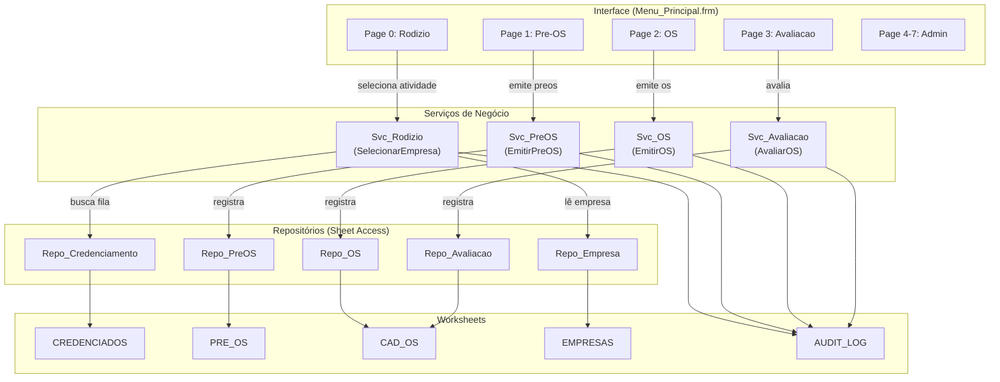

# MAPA DE ARQUITETURA - SISTEMA DE CREDENCIAMENTO

**Versão:** V12.0.0156  
**Data de Análise:** 15 de abril de 2026  
**Baseado em:** Engenharia reversa de vba_export/

---

## 1. VISÃO GERAL ARQUITETURAL

```
┌─────────────────────────────────────────────────────────────┐
│                    APLICAÇÃO EXCEL/VBA                       │
│                  (Credenciamento & Rodízio)                  │
├─────────────────────────────────────────────────────────────┤
│  INTERFACE (13 UserForms + Menu_Principal MultiPage)        │
│  ├─ Menu_Principal.frm (8 páginas via MultiPage)            │
│  ├─ Credencia_Empresa, Altera_Empresa, Reativa_Empresa      │
│  ├─ Altera_Entidade, Reativa_Entidade, Cadastro_Servico     │
│  ├─ Configuracao_Inicial, Limpar_Base, ProgressBar          │
│  ├─ Rel_Emp_Serv, Rel_OSEmpresa                             │
│  └─ Fundo_Branco (splash/loading)                           │
├─────────────────────────────────────────────────────────────┤
│  SERVIÇOS DE NEGÓCIO (Svc_*)                                │
│  ├─ Svc_Rodizio.bas (SelecionarEmpresa, AvancarFila)       │
│  ├─ Svc_PreOS.bas (EmitirPreOS, ReusarParaRecusa, etc)     │
│  ├─ Svc_OS.bas (EmitirOS, CancelarOS)                       │
│  └─ Svc_Avaliacao.bas (AvaliarOS, Suspender, Reativar)     │
├─────────────────────────────────────────────────────────────┤
│  REPOSITÓRIOS (Repo_*)                                      │
│  ├─ Repo_Empresa.bas (LerEmpresa, GravarEmpresa)            │
│  ├─ Repo_Credenciamento.bas (CRUD Credenciamento)          │
│  ├─ Repo_PreOS.bas (CRUD Pre-OS)                            │
│  ├─ Repo_OS.bas (CRUD OS)                                   │
│  └─ Repo_Avaliacao.bas (CRUD Avaliação)                     │
├─────────────────────────────────────────────────────────────┤
│  SUPORTE (Util_*, Mod_Types, Const_Colunas, etc)           │
│  ├─ Mod_Types.bas (Definição de 10 tipos públicos)         │
│  ├─ Const_Colunas.bas (Mapeamento coluna↔nome constante)   │
│  ├─ Util_Config.bas (GetConfig, SetConfig)                 │
│  ├─ Util_Conversao.bas (Conversão de dados)                │
│  ├─ Util_Planilha.bas (Acesso sheets genérico)             │
│  ├─ Audit_Log.bas (14 tipos de eventos, 7 entidades)       │
│  ├─ ErrorBoundary.bas (Try-Catch genérico)                 │
│  ├─ AppContext.bas (Variável global TAppContext)           │
│  └─ Funcoes.bas (Utilitários diversos)                      │
├─────────────────────────────────────────────────────────────┤
│  TESTES E DIAGNOSTICO                                       │
│  ├─ Teste_Bateria_Oficial.bas (BO_xxx, 200 testes)         │
│  ├─ Teste_UI_Guiado.bas (UI-01 a UI-10)                     │
│  ├─ Treinamento_Painel.bas (T01-T21, manual)                │
│  ├─ Central_Testes.bas (16-step quick roteiro)              │
│  ├─ Central_Testes_Relatorio.bas (exportação CSV)           │
│  └─ DiagnosticoV5.bas (Verificações de integridade)        │
├─────────────────────────────────────────────────────────────┤
│  DADOS (12 Worksheets)                                      │
│  ├─ CONFIG: parametros globais (linha 1=cabeçalho, 2=valores)
│  ├─ EMPRESAS: cadastro ativo (20 colunas A-T)              │
│  ├─ EMPRESAS_INATIVAS: arquivo histórico                    │
│  ├─ ENTIDADE: clientes/órgãos (23 colunas A-W)              │
│  ├─ ENTIDADE_INATIVOS: arquivo histórico                    │
│  ├─ ATIVIDADES: tabela de CNAE (3 colunas)                 │
│  ├─ CAD_SERV: serviços por atividade (9 colunas A-I)       │
│  ├─ CREDENCIADOS: fila de rodízio por atividade (15 colunas)
│  ├─ PRE_OS: solicitações propostas (14 colunas A-N)         │
│  ├─ CAD_OS: ordens de serviço emitidas (30 colunas A-AD)   │
│  ├─ AUDIT_LOG: trilha de eventos (9 colunas A-I)            │
│  └─ RELATORIO: dashboard / sumários (dinâmico)             │
└─────────────────────────────────────────────────────────────┘
```

---

## 2. MÓDULOS VBA - INVENTÁRIO COMPLETO

### 2.1 Definição de Tipos e Constantes

| Módulo | Responsabilidade | Crítico? | Linhas |
|--------|------------------|----------|--------|
| Mod_Types.bas | 10 tipos públicos: TResult, TAtividade, TServico, TEmpresa, TCredenciamento, TEntidade, TPreOS, TOS, TAvaliacao, TConfig, TRodizioResultado, TAppContext | SIM | ~180 |
| Const_Colunas.bas | Mapeamento coluna↔constante para 12 sheets (LINHA_DADOS=2, COL_*) | SIM | ~185 |
| Variaveis.bas | Variáveis globais (obsoleto/legado) | NÃO | ~50 |

### 2.2 Serviços de Negócio

| Módulo | Função Principal | Público? | Crítico? |
|--------|-----------------|----------|----------|
| Svc_Rodizio.bas | SelecionarEmpresa (filtros A-E), AvancarFila, Suspender, Reativar | SIM | **SIM** |
| Svc_PreOS.bas | EmitirPreOS, ReusarParaRecusa, Expirar, ConvertidoOS | SIM | SIM |
| Svc_OS.bas | EmitirOS, CancelarOS, LogarOS | SIM | SIM |
| Svc_Avaliacao.bas | AvaliarOS (10 notas), auto-suspensão por nota baixa | SIM | SIM |

### 2.3 Repositórios (Acesso a Dados)

| Módulo | CRUD Sobre | Funções Principais |
|--------|-----------|-------------------|
| Repo_Empresa.bas | EMPRESAS sheet | LerEmpresa, GravarEmpresa, BuscarPorCNPJ |
| Repo_Credenciamento.bas | CREDENCIADOS sheet | InserirCredenciamento, AtualizarPosicao, BuscarFila |
| Repo_PreOS.bas | PRE_OS sheet | InserirPreOS, AtualizarStatus, BuscarPorId |
| Repo_OS.bas | CAD_OS sheet | InserirOS, AtualizarStatus, BuscarPorId |
| Repo_Avaliacao.bas | CAD_OS (colunas X=MEDIA, N-W=notas) | InserirAvaliacao, AtualizarMedia |

### 2.4 Utilitários e Suporte

| Módulo | Responsabilidade | Observação |
|--------|-----------------|-----------|
| Util_Config.bas | GetConfig() lê CONFIG sheet linha 2 | Protegido contra leitura direta |
| Util_Conversao.bas | StringToLong, DateToString, etc | Conversão segura com tratamento de erro |
| Util_Planilha.bas | UltimaLinhaAba, PrimeiraLinhaDados, IdsIguais | Operações genéricas em sheets |
| Funcoes.bas | Diversos helpers (MontarMotivoSemAptos, etc) | Agrupado por tema em arquivos posteriores |
| Audit_Log.bas | RegistrarEvento, 14 tipos (EVT_*), 7 entidades (ENT_*) | **Crítico para compliance** |
| ErrorBoundary.bas | Wrapper Try-Catch genérico | Pouco usado em prática |
| AppContext.bas | TAppContext global (contexto sessão) | Risco de sincronização |

### 2.5 Testes e Diagnostico

| Módulo | Tipo | Testes | Status |
|--------|------|--------|--------|
| Teste_Bateria_Oficial.bas | Automatizado | BO_000 a BO_2XX (200 planejados) | 6 blocos, ~50 BO_xxx completos |
| Teste_UI_Guiado.bas | Semi-automatizado | UI-01 a UI-10 | 10 testes, heurístico |
| Treinamento_Painel.bas | Manual com Checklist | T01-T21 | 21 testes, planilha de respostas |
| Central_Testes.bas | Orquestrador | 16-step roteiro | Quick start |
| Central_Testes_Relatorio.bas | Exportação | CSV completo + falhas | Para análise pós-bateria |

### 2.6 Inicialização e Release

| Módulo | Responsabilidade |
|--------|-----------------|
| Auto_Open.bas | Macro executada ao abrir .xlsm (setup inicial) |
| App_Release.bas | Versionamento, informações de release |
| Importador_VBA.bas | Re-importação de módulos (maintenance) |

---

## 3. MAPEAMENTO DE WORKSHEETS vs CONST_COLUNAS

| Sheet | Const | Primeira Linha | Dados Início | Última Col | Propósito |
|-------|-------|---|---|---|---|
| CONFIG | SHEET_CONFIG | Cabeçalho | LINHA_CFG_VALORES=2 | J (COL_CFG_SECRETARIA) | Parâmetros globais (1 linha dados) |
| EMPRESAS | SHEET_EMPRESAS | Cabeçalho | LINHA_DADOS=2 | T (20 cols) | Cadastro empresas ativas |
| EMPRESAS_INATIVAS | SHEET_EMPRESAS_INATIVAS | Cabeçalho | LINHA_DADOS=2 | T | Histórico empresas inativas |
| ENTIDADE | SHEET_ENTIDADE | Cabeçalho | LINHA_DADOS=2 | W (23 cols) | Cadastro entidades/clientes |
| ENTIDADE_INATIVOS | SHEET_ENTIDADE_INATIVOS | Cabeçalho | LINHA_DADOS=2 | W | Histórico entidades inativas |
| ATIVIDADES | SHEET_ATIVIDADES | Cabeçalho | LINHA_DADOS=2 | C (3 cols) | Tabela CNAE (baseline estrutural) |
| CAD_SERV | SHEET_CAD_SERV | Cabeçalho | LINHA_DADOS=2 | I (9 cols) | Serviços por atividade |
| CREDENCIADOS | SHEET_CREDENCIADOS | Cabeçalho | LINHA_DADOS=2 | O (15 cols) | Fila de rodízio (POSICAO_FILA) |
| PRE_OS | SHEET_PREOS | Cabeçalho | LINHA_DADOS=2 | N (14 cols) | Solicitações propostas |
| CAD_OS | SHEET_CAD_OS | Cabeçalho | LINHA_DADOS=2 | AD (30 cols) | Ordens de serviço + notas (N-W=notas, X=média) |
| AUDIT_LOG | SHEET_AUDIT | Cabeçalho | LINHA_DADOS=2 | I (9 cols) | Trilha de eventos (imutável) |
| RELATORIO | SHEET_RELATORIO | Dinâmico | - | - | Dashboard / sumários (recalculado) |

---

## 4. FLUXO DE DADOS CRÍTICO: RODÍZIO

```
Menu_Principal.Page_Rodizio (UI)
    ↓
Svc_Rodizio.SelecionarEmpresa(ATIV_ID)
    ├─ Repo_Credenciamento.BuscarFila(ATIV_ID) → array TCredenciamento[]
    ├─ Para cada cred na fila:
    │   ├─ [FILTRO A] STATUS_CRED <> ATIVO → skip
    │   ├─ [FILTRO B] STATUS_GLOBAL = SUSPENSA_GLOBAL → auto-reativar se vencido
    │   ├─ [FILTRO C] STATUS_GLOBAL = INATIVA → skip
    │   ├─ [FILTRO D] TemOSAbertaNaAtividade → MoverFinal, skip
    │   ├─ [FILTRO E] TemPreOSPendenteNaAtividade → skip (SEM mover)
    │   └─ [APTO] RegistrarIndicacao(DT_ULTIMA_IND), retorna TRodizioResultado
    └─ Retorna empresa eleita OU MotivoFalha

Svc_PreOS.EmitirPreOS(ATIV_ID, SERV_ID, ENT_ID, empresa selecionada)
    ├─ Cria TPreOS com status=AGUARDANDO_ACEITE
    ├─ Repo_PreOS.Inserir
    ├─ Audit_Log.RegistrarEvento(EVT_PREOS_EMITIDA, ENT_PREOS, ...)
    └─ Retorna PREOS_ID

[Usuário rejeita ou prazo expira]
    ↓
Svc_PreOS.ReusarParaRecusa(PREOS_ID) OU Svc_PreOS.Expirar(PREOS_ID)
    ├─ Atualiza PRE_OS.STATUS = RECUSADA | EXPIRADA
    ├─ Svc_Rodizio.AvancarFila(EMP_ID, ATIV_ID, IsPunido=True, "RECUSADA"/"EXPIRADA")
    │   ├─ IncrementarRecusa (QTD_RECUSAS++) 
    │   ├─ Se QTD_RECUSAS >= MAX_RECUSAS → Suspender
    │   └─ Audit_Log.RegistrarEvento(EVT_PREOS_RECUSADA | EVT_PREOS_EXPIRADA, ...)
    └─ Volta a SelecionarEmpresa (próxima empresa na fila)

[Usuário aceita]
    ↓
Svc_OS.EmitirOS(PREOS_ID, QT_CONFIRMADA)
    ├─ Cria TOS com status=EM_EXECUCAO
    ├─ PRE_OS.STATUS = CONVERTIDA_OS
    ├─ Repo_OS.Inserir
    ├─ Svc_Rodizio.AvancarFila(EMP_ID, ATIV_ID, IsPunido=False, "ACEITE_OS_EMITIDA")
    └─ Audit_Log.RegistrarEvento(EVT_OS_EMITIDA, ...)

[OS executada]
    ↓
Svc_Avaliacao.AvaliarOS(OS_ID, notas[1..10], QtExecutada)
    ├─ media = soma(notas) / 10#
    ├─ Se media < notaMin → Suspender(EMP_ID)
    ├─ Repo_Avaliacao.Inserir (persiste MEDIA em coluna X)
    ├─ Svc_Rodizio.AvancarFila(EMP_ID, ATIV_ID, IsPunido=False, "AVALIACAO_CONCLUIDA")
    └─ Audit_Log.RegistrarEvento(EVT_OS_FECHADA, ...)
```

---

## 5. DEPENDÊNCIAS ENTRE MÓDULOS

### Mapa de Dependências (Simplificado)

```
Svc_Rodizio (CORE)
  ├─ Repo_Empresa (lê/grava empresa)
  ├─ Repo_Credenciamento (busca fila)
  ├─ Audit_Log (registra eventos)
  └─ Util_Config (lê MAX_RECUSAS, PERIODO_SUSPENSAO_MESES)

Svc_PreOS
  ├─ Svc_Rodizio (seleciona empresa)
  ├─ Repo_PreOS (CRUD)
  ├─ Repo_Credenciamento
  ├─ Audit_Log
  └─ Util_Config (lê DIAS_DECISAO)

Svc_OS
  ├─ Repo_OS (CRUD)
  ├─ Repo_PreOS (busca Pre-OS)
  ├─ Svc_Rodizio (avança fila)
  └─ Audit_Log

Svc_Avaliacao
  ├─ Repo_OS (busca OS)
  ├─ Repo_Avaliacao (persiste)
  ├─ Svc_Rodizio (avança fila, Suspender)
  ├─ Util_Config (lê NOTA_MINIMA)
  └─ Audit_Log

Menu_Principal (UI)
  ├─ Svc_* (todos)
  ├─ Repo_* (todos)
  └─ Preencher (popular listboxes, filtrar)
```

---

## 6. DIVERGÊNCIAS: DOCUMENTAÇÃO vs CÓDIGO REAL

| Documentação Afirma | Código Implementa | Evidência no Código | Risco |
|-------------------|-----------------|------|------|
| TResult com "Dados As Variant" | TResult.IdGerado As String | Mod_Types.bas:15 | Type mismatch silencioso em atribuições |
| TEmpresa com campos "simples" | TEmpresa com 8+ campos (DT_FIM_SUSP, QTD_RECUSAS, etc.) | Mod_Types.bas:43-59 | Documentação incompleta; debugging lento |
| "27 módulos, 13 forms" | ~32 módulos identificados, 13 forms | vba_export/*.bas | Inventário obsoleto |
| Algoritmo "score-based" | POSICAO_FILA queue-based com filtros A-E | Svc_Rodizio.bas:39-154 | Fluxo de negócio mal compreendido |
| "SaaS layer" mencionada | Código 100% VBA, sem integração remota | Nenhum HTTP/API | Fantasma arquitetural |
| "ErrorBoundary.bas define padrão" | Existe mas raramente invocado | ErrorBoundary.bas vs Svc_*.bas | Padrão não adotado sistematicamente |

---

## 7. ESTRUTURA FÍSICA DO REPOSITÓRIO VBA

```
vba_export/
├── 01_Tipos_Constantes/
│   ├── Mod_Types.bas
│   ├── Const_Colunas.bas
│   ├── Variaveis.bas (legado)
│   └── AAA_Types.bas (alias?)
│
├── 02_Servicos/
│   ├── Svc_Rodizio.bas
│   ├── Svc_PreOS.bas
│   ├── Svc_OS.bas
│   └── Svc_Avaliacao.bas
│
├── 03_Repositorios/
│   ├── Repo_Empresa.bas
│   ├── Repo_Credenciamento.bas
│   ├── Repo_PreOS.bas
│   ├── Repo_OS.bas
│   └── Repo_Avaliacao.bas
│
├── 04_Utilitarios/
│   ├── Util_Config.bas
│   ├── Util_Conversao.bas
│   ├── Util_Planilha.bas
│   ├── Funcoes.bas
│   ├── Audit_Log.bas
│   ├── ErrorBoundary.bas
│   ├── AppContext.bas
│   └── Classificar.bas
│
├── 05_UI/
│   └── Menu_Principal.frm (+ 12 outras forms)
│
├── 06_Testes/
│   ├── Teste_Bateria_Oficial.bas
│   ├── Teste_UI_Guiado.bas
│   ├── Treinamento_Painel.bas
│   ├── Central_Testes.bas
│   ├── Central_Testes_Relatorio.bas
│   └── DiagnosticoV5.bas
│
└── 07_Suporte/
    ├── Auto_Open.bas
    ├── App_Release.bas
    ├── Importador_VBA.bas
    ├── Preencher.bas
    ├── Emergencia_CNAE.bas
    └── (outros helpers)
```

---

## 8. MERMAID: COMPONENTES E FLUXO



---

## CONCLUSÃO

A arquitetura é **em camadas bem definidas** (UI → Svc → Repo → Data), com **separação clara de responsabilidades**. Porém:

1. **Documentação está 2-3 sprints atrás** do código real (tipos, campos, contagem)
2. **Dependências cíclicas leves** (Svc_Avaliacao chama Suspender que pertence a Svc_Rodizio)
3. **AppContext global é ponto fraco** (sem sincronização)
4. **Ordem de compilação VBA é bomba armada** (não pode reorganizar tipos)

**Recomendação:** Atualizar documentação versus código imediatamente. Ordem de compilação deve ser documentada em arquivo COMPILATION_ORDER.txt para preservar histórico de refatorações.

